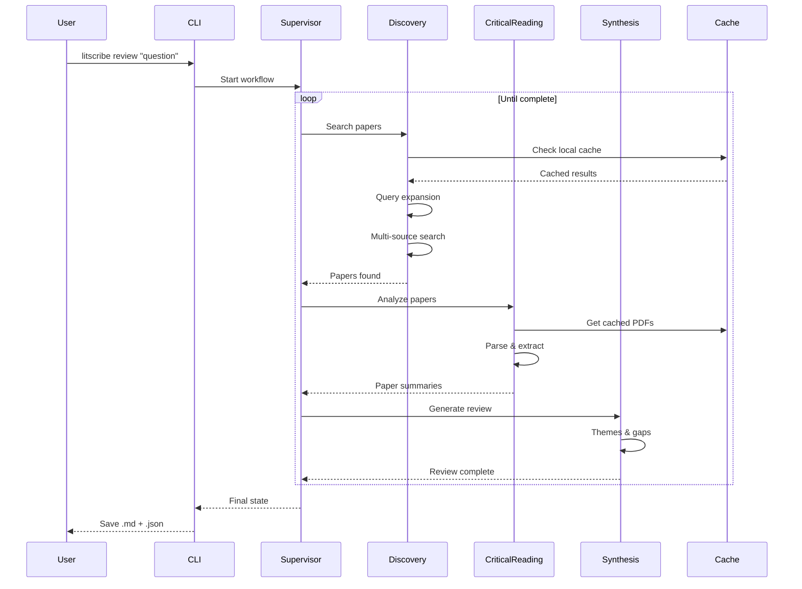

# LitScribe

**LitScribe** is an autonomous academic synthesis engine designed to transform how researchers conduct literature reviews. By leveraging the **Model Context Protocol (MCP)** and a **Multi-Agent** architecture, LitScribe goes beyond simple summarization to provide deep, cross-paper synthesis and gap analysis.

---

## Vision

The goal of LitScribe is to act as a rigorous "Digital Scribe" for scholars—faithfully organizing human knowledge while eliminating the hallucinations common in vanilla LLM outputs.

## Key Features

### Multi-Agent Literature Review
- **Discovery Agent**: Query expansion, multi-source search (parallel), snowball sampling
- **Critical Reading Agent**: PDF parsing, key findings extraction, methodology analysis (batched)
- **GraphRAG Agent**: Knowledge graph construction, entity extraction, community detection
- **Synthesis Agent**: GraphRAG-enhanced theme identification, gap analysis, review generation
- **Supervisor Agent**: LangGraph-based workflow orchestration with state routing

### Multi-Source Search
- Unified search across **arXiv**, **PubMed**, **Semantic Scholar**
- **Zotero** integration for personal library management
- Intelligent deduplication and merging across sources
- Citation tracking and paper recommendations

### Export & Citations
- **BibTeX** export with auto-detected entry types
- **5 citation styles**: APA, MLA, IEEE, Chicago, GB/T 7714
- **Multi-format export**: Word (.docx), PDF, HTML, LaTeX, Markdown

### Caching & Persistence
- **SQLite cache**: Local-first search, PDF caching, parse results
- **GraphRAG cache**: Entity extraction results, graph edges, community data
- **Checkpointing**: Resume interrupted reviews via `thread_id`
- **Incremental updates**: Only fetch what's missing, reuse cached entities

### PDF Processing
- High-fidelity PDF-to-Markdown conversion
- LaTeX equation preservation
- Dual backend: `pymupdf4llm` (fast) / `marker-pdf` (OCR)

### Local-First Search & Zotero Integration
- **Local-first**: SQLite cache → Zotero library → external APIs (only fetch what's missing)
- **Zotero bidirectional sync**: Import from collections, auto-save discoveries, write analysis notes back
- **Local PDF injection**: Include your own PDFs alongside searched papers
- **User config**: Persistent preferences via `~/.litscribe/config.yaml`

### Multi-Language Review Generation
- **Direct generation**: Write reviews in the target language (not translate after)
- `--lang zh`: Chinese academic writing with formal scholarly tone
- Generic fallback for other languages
- Search queries always in English for optimal database coverage

### GraphRAG Knowledge Synthesis (Phase 7.5) ✨
- **Entity extraction**: Automatic identification of methods, datasets, metrics, concepts
- **Entity linking**: Cross-paper entity deduplication using embeddings
- **Knowledge graph**: NetworkX-based graph with papers, entities, and relationships
- **Community detection**: Leiden algorithm for hierarchical clustering
- **Global synthesis**: Multi-level summarization from entity → community → global
- **Deep integration**: Communities used directly as themes in synthesis

## Tech Stack

- **Language:** Python 3.12+
- **Orchestration:** LangGraph (multi-agent framework with state management)
- **Async Processing:** asyncio with concurrent batching and semaphore control
- **Interface:** FastMCP 2.0 (direct import, not protocol-based)
- **Storage:** SQLite (cache, checkpointing, GraphRAG data)
- **Knowledge Graph:** NetworkX + graspologic (Leiden community detection)
- **Embeddings:** sentence-transformers (entity linking)
- **Cloud LLM:** Claude Opus 4.5 / Sonnet 4.5 / DeepSeek-R1
- **PDF Processing:** pymupdf4llm (default) / marker-pdf (OCR)

## Architecture

```
┌─────────────────────────────────────────────────────────────────────┐
│                        LitScribe Architecture                        │
├─────────────────────────────────────────────────────────────────────┤
│                                                                     │
│  Research Question                                                  │
│        │                                                            │
│        ▼                                                            │
│  ┌──────────────┐                                                   │
│  │  Supervisor  │◄────────────────────────────────┐                │
│  │    Agent     │                                 │                │
│  └──────┬───────┘                                 │                │
│         │                                         │                │
│         ▼                                         │                │
│  ┌──────────────┐     ┌─────────────────┐        │                │
│  │  Discovery   │────▶│ MCP Servers     │        │                │
│  │    Agent     │     │ • arXiv         │        │                │
│  │              │     │ • PubMed        │        │                │
│  │ • Query exp  │     │ • Semantic S.   │        │                │
│  │ • Search     │     │ • Zotero        │        │                │
│  │ • Snowball   │     └─────────────────┘        │                │
│  └──────┬───────┘                                │                │
│         │                                         │                │
│         ▼                                         │                │
│  ┌──────────────┐     ┌─────────────────┐        │                │
│  │  Critical    │────▶│ PDF Parser      │        │                │
│  │  Reading     │     │ • pymupdf4llm   │        │                │
│  │    Agent     │     │ • marker-pdf    │        │                │
│  │              │     └─────────────────┘        │                │
│  │ • Parse PDF  │                                │                │
│  │ • Findings   │     ┌─────────────────┐        │                │
│  │ • Quality    │────▶│ SQLite Cache    │        │                │
│  └──────┬───────┘     │ • Papers        │        │                │
│         │             │ • PDFs          │        │                │
│         ▼             │ • Checkpoints   │        │                │
│  ┌──────────────┐     └─────────────────┘        │                │
│  │  Synthesis   │                                │                │
│  │    Agent     │────────────────────────────────┘                │
│  │              │                                                  │
│  │ • Themes     │     ┌─────────────────┐                         │
│  │ • Gaps       │────▶│ Export          │                         │
│  │ • Review     │     │ • BibTeX        │                         │
│  └──────────────┘     │ • Word/PDF      │                         │
│                       │ • Markdown      │                         │
│                       └─────────────────┘                         │
│                                                                     │
└─────────────────────────────────────────────────────────────────────┘
```

### Workflow



## Quick Start

### Prerequisites

- Python 3.12+ (via mamba/conda)
- API keys: Anthropic (Claude), optional: NCBI, Semantic Scholar, Zotero

### Installation

```bash
# Clone the repository
git clone https://github.com/yourusername/LitScribe.git
cd LitScribe

# Create environment
mamba env create -f environment.yml
mamba activate litscribe

# Install as editable package
pip install -e .

# Configure API keys
cp .env.example .env
# Edit .env with your keys

# Verify
litscribe --help
```

### Usage

```bash
# === Literature Review ===
litscribe review "What are the latest advances in LLM reasoning?"
litscribe review "CRISPR applications" -s pubmed,arxiv -p 15
litscribe review "石杉碱甲生物合成" --lang zh           # Chinese review
litscribe review "topic" --local-files a.pdf b.pdf      # Include local PDFs

# === GraphRAG-Enhanced Review (Default) ===
litscribe review "LLM fine-tuning methods" -p 10 --enable-graphrag
litscribe review "transformer architectures" -p 20 --disable-graphrag

# === Export ===
litscribe export review.json -f docx -s apa      # Word (APA style)
litscribe export review.json -f pdf -s ieee      # PDF (IEEE style)
litscribe export review.json -f bibtex           # BibTeX only
litscribe export review.json -f md -l zh         # Chinese Markdown

# === Search ===
litscribe search "transformer attention" --sources arxiv,semantic_scholar
litscribe search "CRISPR" --sources pubmed --limit 20 --sort citations

# === Paper / PDF ===
litscribe paper arXiv:1706.03762 --verbose
litscribe parse paper.pdf --output paper.md

# === Config & Cache ===
litscribe config show                 # Show current config
litscribe config set max_papers 20    # Set default
litscribe cache stats                 # Cache statistics
litscribe cache clear --expired       # Clear expired entries
```

### Output Files

When running `litscribe review`, outputs are saved to `output/`:
- `review_*.md` - Literature review in Markdown
- `review_*.json` - Full data (papers, analysis, synthesis)

Export generates additional formats:
- `review_*.bib` - BibTeX citations
- `review_*.docx` - Word document
- `review_*.pdf` - PDF (requires Pandoc + LaTeX)

## Project Status

### Completed

| Phase | Description | Status |
|-------|-------------|--------|
| MVP | MCP servers, unified search, CLI | ✅ Done |
| Iteration 2 | Multi-agent system, LangGraph | ✅ Done |
| Phase 6.5 | SQLite cache, checkpointing | ✅ Done |
| Phase 7 | BibTeX, export, citation styles | ✅ Done |
| Phase 7.5 | GraphRAG, scale-up (50-500 papers) | ✅ Done |
| **Phase 8** | **Zotero sync, local files, multi-lang generation, user config** | **✅ Done** |

### Planned

| Phase | Description | Priority |
|-------|-------------|----------|
| Phase 9 | Self-Review Agent, Planning Agent, iterative refinement | High |
| Phase 10 | MCP architecture cleanup, GraphRAG optimization | Medium |
| Phase 11 | Local LLM support (Ollama/MLX/vLLM) | Medium |

## Development Notes

### PDF Parsing Backend

| Backend | Speed | OCR | Stability | Use Case |
|---------|-------|-----|-----------|----------|
| `pymupdf4llm` | Fast | No | Stable | Native text PDFs |
| `marker-pdf` | Slow | Yes | Unstable (MPS) | Scanned PDFs |

### Rate Limits

| API | Limit | Mitigation |
|-----|-------|------------|
| Semantic Scholar | 1 req/s | AsyncRateLimiter |
| PubMed | 3 req/s (no key) | Cache + batch |
| arXiv | No limit | Polite delay |

### LLM Strategy

| Task | Model | Reason |
|------|-------|--------|
| Query expansion | Haiku | Simple, low cost |
| Paper analysis | Sonnet 4.5 | Balance quality/cost |
| Entity extraction | Sonnet 4.5 | Structured output |
| Community summary | Sonnet 4.5 | Synthesis quality |
| Review synthesis | Opus 4.5 | Complex reasoning |
| Batch processing | DeepSeek-R3 | Cost-effective |

### Architecture Notes

**MCP Integration**: The project uses FastMCP decorators but **directly imports** functions rather than using MCP protocol (stdio/HTTP). This design prioritizes:
- Lower latency (no IPC overhead)
- Simpler error handling
- Easier debugging
- Tighter integration with LangGraph

Future work may add true MCP server mode for external client access.

---

## License

MIT License - feel free to use and contribute.

## Contact

*Created by Arnold - Exploring the future of AI4Sci.*
