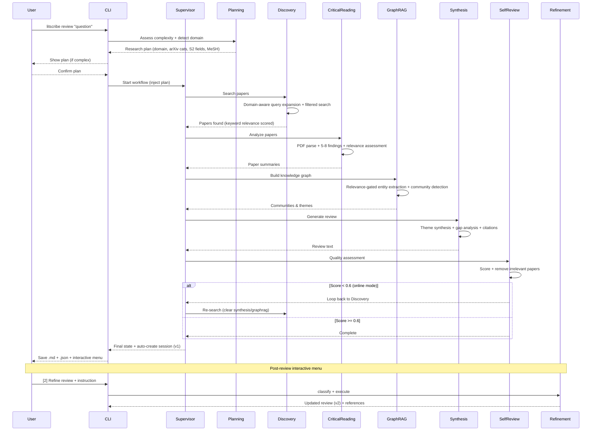

# LitScribe

**LitScribe** is an autonomous academic synthesis engine designed to transform how researchers conduct literature reviews. By leveraging the **Model Context Protocol (MCP)** and a **Multi-Agent** architecture, LitScribe goes beyond simple summarization to provide deep, cross-paper synthesis and gap analysis.

---

## Vision

The goal of LitScribe is to act as a rigorous "Digital Scribe" for scholars—faithfully organizing human knowledge while eliminating the hallucinations common in vanilla LLM outputs.

## Key Features

### Multi-Agent Literature Review
- **Supervisor Agent**: LangGraph-based workflow orchestration with state routing, self-review loop-back
- **Planning Agent**: Complexity assessment (1-5), sub-topic decomposition, **domain detection** (arXiv categories, S2 fields, PubMed MeSH), CLI confirmation for complex plans
- **Discovery Agent**: **Domain-aware** query expansion, multi-source search with field filtering, keyword-validated snowball sampling
- **Critical Reading Agent**: PDF parsing, 5-8 key findings extraction, methodology analysis, **LLM-assessed relevance scoring**
- **GraphRAG Agent**: Knowledge graph construction, entity extraction with research context, **relevance-gated** (filters low-relevance papers)
- **Synthesis Agent**: GraphRAG-enhanced theme identification, gap analysis, review generation with formatted citations
- **Self-Review Agent**: Quality assessment, **actionable irrelevant paper removal**, loop-back to Discovery when score < 0.6
- **Refinement Agent**: Iterative review modification via natural language instructions, in-process refinement from post-review menu

### Multi-Source Search
- Unified search across **arXiv**, **PubMed**, **Semantic Scholar**
- **Domain filtering**: arXiv category, Semantic Scholar `fields_of_study`, PubMed MeSH terms
- **Keyword-based relevance scoring** (replaces positional scoring) — title/abstract/keyword matching
- **Zotero** integration for personal library management
- Intelligent deduplication and merging across sources
- Citation tracking and paper recommendations

### Export & Citations
- **BibTeX** export with auto-detected entry types
- **5 citation styles**: APA, MLA, IEEE, Chicago, GB/T 7714
- **Multi-format export**: Word (.docx), PDF, HTML, LaTeX, Markdown

### Caching & Persistence
- **SQLite cache**: Local-first search, PDF caching, parse results
- **GraphRAG cache**: Entity extraction results, graph edges, community data
- **Checkpointing**: Resume interrupted reviews via `thread_id`
- **Incremental updates**: Only fetch what's missing, reuse cached entities

### PDF Processing
- High-fidelity PDF-to-Markdown conversion
- LaTeX equation preservation
- Dual backend: `pymupdf4llm` (fast) / `marker-pdf` (OCR)

### Local-First Search & Zotero Integration
- **Local-first**: SQLite cache → Zotero library → external APIs (only fetch what's missing)
- **Zotero bidirectional sync**: Import from collections, auto-save discoveries, write analysis notes back
- **Local PDF injection**: Include your own PDFs alongside searched papers
- **User config**: Persistent preferences via `~/.litscribe/config.yaml`

### Multi-Language Review Generation
- **Direct generation**: Write reviews in the target language (not translate after)
- `--lang zh`: Chinese academic writing with formal scholarly tone
- Generic fallback for other languages
- Search queries always in English for optimal database coverage

### GraphRAG Knowledge Synthesis
- **Entity extraction**: Automatic identification of methods, datasets, metrics, concepts
- **Entity linking**: Cross-paper entity deduplication using embeddings
- **Knowledge graph**: NetworkX-based graph with papers, entities, and relationships
- **Community detection**: Leiden algorithm for hierarchical clustering
- **Global synthesis**: Multi-level summarization from entity → community → global
- **Deep integration**: Communities used directly as themes in synthesis

### Quality Assurance & Iterative Refinement
- **Self-Review**: Automated scoring (relevance, coverage, coherence, argumentation), **actionable** irrelevant paper removal, loop-back to Discovery when quality < 0.6
- **Planning**: Complexity-aware sub-topic decomposition, **domain detection** for search filtering, CLI confirmation before execution
- **Refinement**: Natural language instructions to modify reviews (add/remove/modify/rewrite sections)
- **Post-Review Menu**: Interactive choices after review — refine in-process, show full text, or save & exit
- **Session Management**: Git-like version tracking with unified diffs, rollback support
- **Language Detection**: Warns on mismatch (e.g., English query + `--lang zh`), auto-suggests correction
- **Local-Files-First**: `--local-files` prompts whether to also search online; supports offline-only analysis
- **Non-blocking**: All quality agents use graceful fallbacks — never block the main workflow

## Tech Stack

- **Language:** Python 3.12+
- **Orchestration:** LangGraph (multi-agent framework with state management)
- **Async Processing:** asyncio with concurrent batching and semaphore control
- **Interface:** FastMCP 2.0 (unified MCP server for external clients)
- **Storage:** SQLite (cache, checkpointing, GraphRAG data)
- **Knowledge Graph:** NetworkX + graspologic (Leiden community detection)
- **Embeddings:** sentence-transformers (entity linking)
- **Cloud LLM:** Claude Opus 4.5 / Sonnet 4.5 / DeepSeek-R1
- **PDF Processing:** pymupdf4llm (default) / marker-pdf (OCR)

## Architecture

```
┌──────────────────────────────────────────────────────────────────────────┐
│                          LitScribe Architecture                          │
├──────────────────────────────────────────────────────────────────────────┤
│                                                                          │
│  Research Question                                                       │
│        │                                                                 │
│        ▼                                                                 │
│  ┌──────────────┐                                                        │
│  │  Supervisor  │◄──────────────────────────────────────┐               │
│  └──────┬───────┘                                       │               │
│         │                                                │               │
│         ▼                                                │               │
│  ┌──────────────┐                                        │               │
│  │  Planning    │  Complexity assessment (1-5)           │               │
│  │    Agent     │  Domain detection + search filters     │               │
│  └──────┬───────┘                                        │               │
│         │                                                │               │
│         ▼                                                │               │
│  ┌──────────────┐     ┌─────────────────┐               │               │
│  │  Discovery   │────▶│ MCP Servers     │               │               │
│  │    Agent     │◄┐   │ • arXiv/PubMed  │               │               │
│  │ • Domain-    │ │   │ • Semantic S.   │               │               │
│  │   aware      │ │   │ • Zotero        │               │               │
│  └──────┬───────┘ │   └─────────────────┘               │               │
│         │         │                                      │               │
│         ▼         │                                      │               │
│  ┌──────────────┐ │   ┌─────────────────┐               │               │
│  │  Critical    │ │──▶│ PDF Parser      │               │               │
│  │  Reading     │ │   │ • pymupdf4llm   │               │               │
│  └──────┬───────┘ │   └─────────────────┘               │               │
│         │         │                                      │               │
│         ▼         │                                      │               │
│  ┌──────────────┐ │   ┌─────────────────┐               │               │
│  │  GraphRAG    │ │──▶│ Knowledge Graph │               │               │
│  │    Agent     │ │   │ • Entities      │               │               │
│  │ • Relevance  │ │   │ • Communities   │               │               │
│  │   gated      │ │   └─────────────────┘               │               │
│  └──────┬───────┘ │                                      │               │
│         │         │                                      │               │
│         ▼         │                                      │               │
│  ┌──────────────┐ │                                      │               │
│  │  Synthesis   │─┼──────────────────────────────────────┘               │
│  │    Agent     │ │                                                      │
│  └──────┬───────┘ │                                                      │
│         │         │                                                      │
│         ▼         │  loop back                                           │
│  ┌──────────────┐ │  (score < 0.6)    ┌─────────────────┐               │
│  │ Self-Review  │─┘                   │ SQLite Cache    │               │
│  │ • Scoring    │                     │ • Papers/PDFs   │               │
│  │ • Remove bad │                     │ • Sessions      │               │
│  │ • Loop-back  │                     │ • Versions      │               │
│  └──────┬───────┘                     └─────────────────┘               │
│         │                                                                │
│         ▼                                                                │
│  ┌──────────────┐     ┌─────────────────┐                               │
│  │  Session     │     │ Export          │                               │
│  │  Created     │     │ • BibTeX        │                               │
│  │  (auto v1)   │     │ • Word/PDF/HTML │                               │
│  └──────┬───────┘     └─────────────────┘                               │
│         │                                                                │
│         ▼                                                                │
│  ┌──────────────┐                                                        │
│  │ Interactive  │  [1] Save & exit                                       │
│  │  Menu / Re-  │  [2] Refine → Refinement Agent → save version         │
│  │  finement    │  [3] Show full text                                    │
│  └──────────────┘                                                        │
│                                                                          │
└──────────────────────────────────────────────────────────────────────────┘
```

### Workflow



## Quick Start

### Prerequisites

- Python 3.12+ (via mamba/conda)
- API keys: Anthropic (Claude), optional: NCBI, Semantic Scholar, Zotero

### Installation

```bash
# Clone the repository
git clone https://github.com/yourusername/LitScribe.git
cd LitScribe

# Create environment
mamba env create -f environment.yml
mamba activate litscribe

# Install as editable package
pip install -e .

# Configure API keys
cp .env.example .env
# Edit .env with your keys

# Verify
litscribe --help
```

### Usage

```bash
# === Literature Review ===
litscribe review "What are the latest advances in LLM reasoning?"
litscribe review "CRISPR applications" -s pubmed,arxiv -p 15
litscribe review "石杉碱甲生物合成" --lang zh           # Chinese review
litscribe review "topic" --local-files a.pdf b.pdf      # Include local PDFs

# === Planning & GraphRAG ===
litscribe review "LLM fine-tuning methods" -p 10 --enable-graphrag
litscribe review "transformer architectures" -p 20 --disable-graphrag
litscribe review "complex multi-domain topic" --plan-only    # Show plan only

# === Session & Refinement ===
litscribe session list                                       # List all sessions
litscribe session show <session_id>                          # Session details + versions
litscribe session refine <id> -i "Add discussion about LoRA" # Iterative refinement
litscribe session diff <id> 1 2                              # Compare two versions
litscribe session rollback <id> 1                            # Rollback to version 1

# === Export ===
litscribe export review.json -f docx -s apa      # Word (APA style)
litscribe export review.json -f pdf -s ieee      # PDF (IEEE style)
litscribe export review.json -f bibtex           # BibTeX only
litscribe export review.json -f md -l zh         # Chinese Markdown

# === Search ===
litscribe search "transformer attention" --sources arxiv,semantic_scholar
litscribe search "CRISPR" --sources pubmed --limit 20 --sort citations

# === Paper / PDF ===
litscribe paper arXiv:1706.03762 --verbose
litscribe parse paper.pdf --output paper.md

# === Config & Cache ===
litscribe config show                 # Show current config
litscribe config set max_papers 20    # Set default
litscribe cache stats                 # Cache statistics
litscribe cache clear --expired       # Clear expired entries
```

### Output Files

When running `litscribe review`, outputs are saved to `output/`:
- `review_*.md` - Literature review in Markdown
- `review_*.json` - Full data (papers, analysis, synthesis)

Export generates additional formats:
- `review_*.bib` - BibTeX citations
- `review_*.docx` - Word document
- `review_*.pdf` - PDF (requires Pandoc + LaTeX)

## Project Status

### Completed

| Phase | Description | Status |
|-------|-------------|--------|
| MVP | MCP servers, unified search, CLI | ✅ Done |
| Iteration 2 | Multi-agent system, LangGraph | ✅ Done |
| Phase 6.5 | SQLite cache, checkpointing | ✅ Done |
| Phase 7 | BibTeX, export, citation styles | ✅ Done |
| Phase 7.5 | GraphRAG, scale-up (50-500 papers) | ✅ Done |
| Phase 8 | Zotero sync, local files, multi-lang generation, user config | ✅ Done |
| Phase 9.1 | Self-Review Agent (auto quality assessment, scoring, gap detection) | ✅ Done |
| Phase 9.2 | Planning Agent (complexity assessment, sub-topic decomposition, `--plan-only`) | ✅ Done |
| **Phase 9.3** | **Refinement Agent, session management, version tracking, diff & rollback** | **✅ Done** |
| **Phase 9.5** | **Evaluation & Instrumentation: token tracking, citation grounding, evaluation framework, ablation flags, failure analysis** | **✅ Done** |
| **Phase 10** | **MCP cleanup → services/, unified MCP server, GraphRAG optimization (threshold clustering, retry, concurrency)** | **✅ Done** |

### Planned

| Phase | Description | Priority |
|-------|-------------|----------|
| Phase 11 | Local LLM support (Ollama/MLX/vLLM) | Medium |
| Phase 12 | Subscription system, daily digest | Medium |
| Phase 13 | Web UI (React + FastAPI) | Medium |

## Testing

```bash
# Run all tests via pytest
pytest

# Run a single test file
pytest tests/test_token_tracker.py -v
```

| File | Module | Tests | Status |
|------|--------|-------|--------|
| `test_cache_manual.py` | Cache DB / Paper Cache / Search Cache | Cache CRUD, async ops | All Pass |
| `test_discovery_cache.py` | Discovery Agent + Cache | State creation, cache-enabled search | All Pass |
| `test_critical_reading_cache.py` | Critical Reading Agent + Cache | PDF/parse caching, cached_tools | All Pass |
| `test_checkpointing.py` | LangGraph Checkpointing | Imports, SQLite saver, graph compilation, ablation flags | 6/6 Pass |
| `test_exporters.py` | BibTeX / Citation / Pandoc | BibTeX export, citation formatting | All Pass |
| `test_graphrag.py` | GraphRAG Pipeline | State types, entity normalization, supervisor routing, tracker params, **retry logic, threshold clustering** | **10/10 Pass** |
| `test_token_tracker.py` | TokenTracker | Init, multi-agent/model, cost estimation, fuzzy matching, CLI format | 13/13 Pass |
| `test_citation_grounding.py` | Citation Grounding | Citation extraction, author matching, grounding rate | 15/15 Pass |
| `test_evaluator.py` | ReviewEvaluator | Search quality, theme coverage, domain purity, failure detection | 18/18 Pass |

See [`tests/README.md`](tests/README.md) for full details.

## Development Notes

### PDF Parsing Backend

| Backend | Speed | OCR | Stability | Use Case |
|---------|-------|-----|-----------|----------|
| `pymupdf4llm` | Fast | No | Stable | Native text PDFs |
| `marker-pdf` | Slow | Yes | Unstable (MPS) | Scanned PDFs |

### Rate Limits

| API | Limit | Mitigation |
|-----|-------|------------|
| Semantic Scholar | 1 req/s | AsyncRateLimiter |
| PubMed | 3 req/s (no key) | Cache + batch |
| arXiv | No limit | Polite delay |

### LLM Strategy

| Task | Model | Reason |
|------|-------|--------|
| Query expansion | Haiku | Simple, low cost |
| Paper analysis | Sonnet 4.5 | Balance quality/cost |
| Entity extraction | Sonnet 4.5 | Structured output |
| Community summary | Sonnet 4.5 | Synthesis quality |
| Review synthesis | Opus 4.5 | Complex reasoning |
| Batch processing | DeepSeek-R3 | Cost-effective |

### Architecture Notes

**MCP Integration**: Internal agents directly import service functions for lower latency and tighter LangGraph integration. A unified MCP server (`src/mcp_server.py`) is also available for external client access via stdio/streamable-http.

**Agent Architecture**: 8 agents orchestrated by LangGraph StateGraph:
- Main pipeline: Supervisor → Planning → Discovery → Critical Reading → GraphRAG → Synthesis → Self-Review
- **Loop-back**: Self-Review can route back to Discovery (score < 0.6), clearing downstream state (synthesis, graphrag, self-review) for a fresh pass
- **Pre-workflow planning**: CLI runs Planning Agent before the graph, injects the approved plan to skip re-planning inside the workflow
- Standalone: Refinement Agent (bypasses main graph, invoked via `session refine` or post-review interactive menu)
- All quality agents (Self-Review, Refinement) use graceful fallbacks and never block the main workflow

---

## License

MIT License - feel free to use and contribute.

## Contact

*Created by Arnold - Exploring the future of AI4Sci.*
