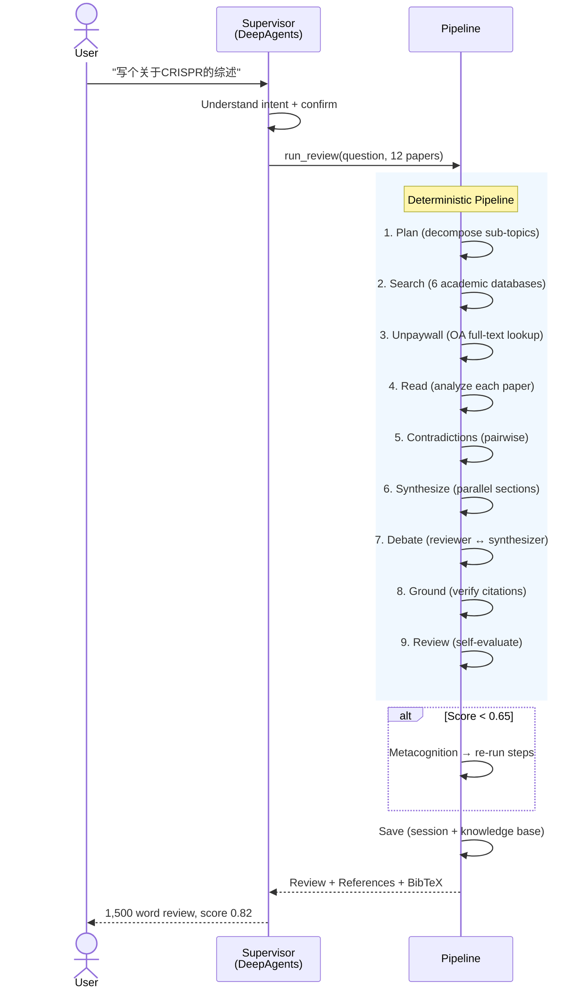
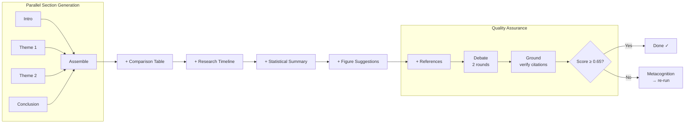
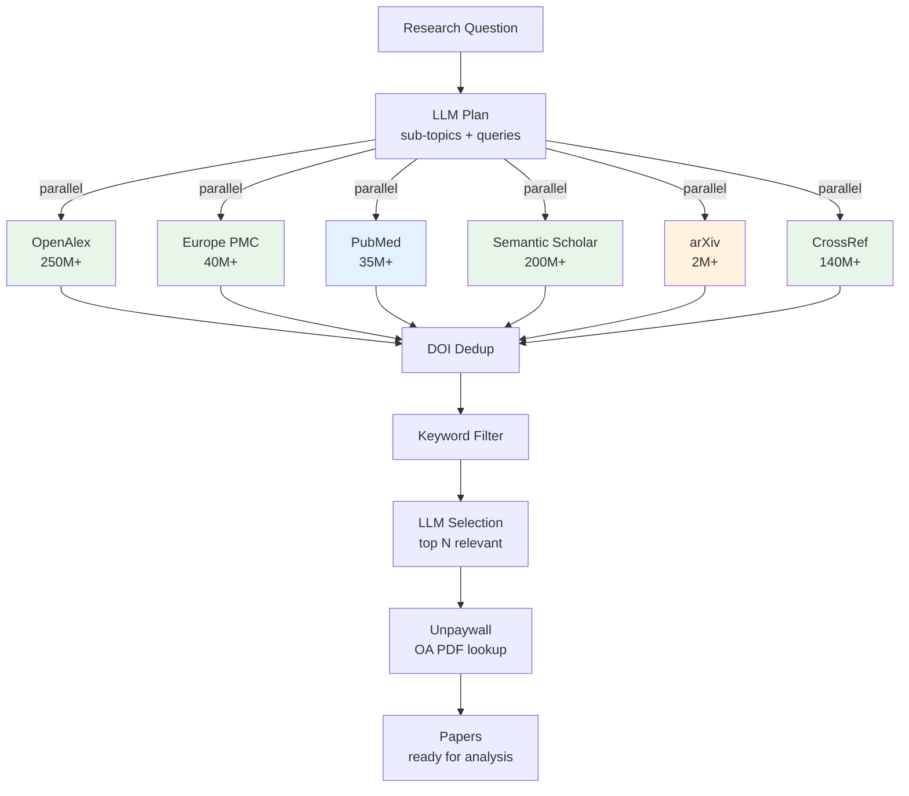

# LitScribe

AI-native literature review workbench with citation grounding and contradiction detection. Ask a research question in the chat, review the proposed outline, and get a grounded literature review with verified citations — then keep editing it conversationally.

> **~15K lines** (Python engine + React workbench) · **49 tests** · **14 CLI commands** · **19 API endpoints** · **6 search sources**

## What it does

```
You: "Review CRISPR knockout strategies in CHO cells for productivity improvement"

LitScribe:
  1. Plans research → proposes an editable section outline (skeleton-first)
     → you confirm / toggle / reorder sections, add constraints
  2. Searches 6 academic databases → 50+ papers found
  3. Filters + analyzes the most relevant papers (full-text when available)
  4. Detects contradictions between papers
  5. Writes the review section-by-section with live progress
  6. Reviewer ↔ Synthesizer debate (2 rounds)
  7. Verifies every citation against source paper (grounding)
  8. Self-evaluates quality, loops back if needed

→ Review with [@key] citations, BibTeX, comparison table, timeline
→ Then refine it in chat ("更正式一点", "add a section on X") with version history
```

## What makes LitScribe different

### 🔬 No other tool does all of these:

| Capability | LitScribe | ChatGPT | Elicit | PaperQA2 | SurveyG |
|-----------|:---------:|:-------:|:------:|:--------:|:-------:|
| Multi-source search (6 databases, 325M+ papers) | ✅ | ❌ | ✅ | ❌ | ❌ |
| Citation grounding (verify every claim) | ✅ | ❌ | ❌ | ✅ | ❌ |
| Contradiction detection (opposing findings) | ✅ | ❌ | ❌ | ✅* | ❌ |
| Multi-agent debate (reviewer ↔ synthesizer) | ✅ | ❌ | ❌ | ❌ | ❌ |
| Metacognitive quality loop | ✅ | ❌ | ❌ | ❌ | ❌ |
| Cross-lingual (Chinese ↔ English) | ✅ | ✅ | ❌ | ❌ | ❌ |
| Local paper modes (draft/outline/augment) | ✅ | ❌ | ❌ | ❌ | ❌ |
| Full-text via Unpaywall (68% OA coverage) | ✅ | ❌ | ❌ | ✅ | ❌ |
| Auto methodology comparison table | ✅ | ❌ | ❌ | ❌ | ❌ |
| Research timeline (foundation→frontier) | ✅ | ❌ | ❌ | ❌ | ✅ |
| Pandoc [@key] + BibTeX export | ✅ | ❌ | ❌ | ❌ | ❌ |
| Session persistence + knowledge base | ✅ | ❌ | ✅ | ❌ | ❌ |

*PaperQA2/ContraCrow detects contradictions but doesn't generate reviews.*

### 🏆 Three novel contributions (not in any existing tool):

**1. Contradiction-Aware Synthesis**
Existing tools either generate reviews (ignoring contradictions) or detect contradictions (without writing reviews). LitScribe is the first to do both end-to-end: detect → inject into narrative → present as critical analysis.

**2. Metacognitive Quality Loop**
After self-review, the system evaluates which pipeline steps failed and autonomously re-runs them with adjusted strategy. Not just "loop back and try again" — it reasons about *what* to fix and *how*.

**3. Search-Augmented Refinement**
When users say "add a section about X", LitScribe doesn't hallucinate — it searches for new papers on X first, analyzes them, then writes the section with real citations from newly found papers.

## Quick Start

```bash
git clone https://github.com/arnold117/LitScribe.git
cd LitScribe
conda create -n litscribe python=3.12 && conda activate litscribe
pip install -e ".[dev]"

litscribe init              # Interactive setup wizard (writes .env)
# or: cp .env.example .env and set llm-key, llm-location, llm-model

litscribe serve             # Web workbench at localhost:8000 (recommended)
litscribe chat              # Terminal — understands natural language
litscribe review "CRISPR CHO knockout" -n 12  # Direct CLI review
```

The prebuilt frontend ships under `litscribe/api/static/dist`, so `litscribe serve`
works out of the box. To develop the UI: `cd frontend && npm install && npm run dev`.

## The Workbench

`litscribe serve` opens a three-panel chat-first workbench (React + TipTap):

```
┌──────────────┬───────────────────────────┬──────────────────┐
│  Sidebar     │  Editor (TipTap)          │  Chat            │
│              │                           │                  │
│ Sessions     │  Rich-text review with    │  Ask, plan,      │
│ Versions     │  citation hover tooltips, │  refine.         │
│ Files        │  track-changes diff,      │  Live progress,  │
│ Graph        │  core / appendix split    │  Stop & Retry,   │
│              │                           │  / commands      │
└──────────────┴───────────────────────────┴──────────────────┘
```

- **Skeleton-first generation** — plan the outline, confirm it, then generate per-section
- **Live progress** — see searching / reading / writing per section, with a Stop button
- **Multi-turn refine** — edits resolve against recent conversation; every change is versioned
- **Slash commands** — `/grill-me`, `/diagnose`, `/abstract`, `/consistency`, `/search`
- **Sidebar tabs** — Sessions, Versions (restore any snapshot), Files (uploads + exports), Citation Graph
- **Editor** — citation hover cards, word-level track-changes, APA / Vancouver / bracket export, core vs. appendix
- **Retry** — failed requests (network, upstream LLM) offer one-click retry

## Architecture

### Pipeline Flow


```mermaid
sequenceDiagram
    actor User
    participant S as Supervisor<br/>(DeepAgents)
    participant P as Pipeline

    User->>S: "写个关于CRISPR的综述"
    S->>S: Understand intent + confirm
    S->>P: run_review(question, 12 papers)

    rect rgb(240, 248, 255)
        Note over P: Deterministic Pipeline
        P->>P: 1. Plan (decompose sub-topics)
        P->>P: 2. Search (6 academic databases)
        P->>P: 3. Unpaywall (OA full-text lookup)
        P->>P: 4. Read (analyze each paper)
        P->>P: 5. Contradictions (pairwise)
        P->>P: 6. Synthesize (parallel sections)
        P->>P: 7. Debate (reviewer ↔ synthesizer)
        P->>P: 8. Ground (verify citations)
        P->>P: 9. Review (self-evaluate)
    end

    alt Score < 0.65
        P->>P: Metacognition → re-run steps
    end

    P->>P: Save (session + knowledge base)
    P-->>S: Review + References + BibTeX
    S-->>User: 1,500 word review, score 0.82
```

### Synthesis Detail


```mermaid
graph LR
    subgraph "Parallel Section Generation"
        A[Intro] --> F[Assemble]
        B[Theme 1] --> F
        C[Theme 2] --> F
        D[Conclusion] --> F
    end

    F --> G[+ Comparison Table]
    G --> H[+ Research Timeline]
    H --> I[+ Statistical Summary]
    I --> J[+ Figure Suggestions]
    J --> K[+ References]

    subgraph "Quality Assurance"
        K --> L[Debate<br/>2 rounds]
        L --> M[Ground<br/>verify citations]
        M --> N{Score ≥ 0.65?}
    end

    N -->|Yes| O[Done ✓]
    N -->|No| P[Metacognition<br/>→ re-run]
```

### Search Architecture


```mermaid
graph TB
    Q[Research Question] --> PLAN[LLM Plan<br/>sub-topics + queries]
    PLAN --> |parallel| OA[OpenAlex<br/>250M+]
    PLAN --> |parallel| EPM[Europe PMC<br/>40M+]
    PLAN --> |parallel| PM[PubMed<br/>35M+]
    PLAN --> |parallel| S2[Semantic Scholar<br/>200M+]
    PLAN --> |parallel| AR[arXiv<br/>2M+]
    PLAN --> |parallel| CR[CrossRef<br/>140M+]

    OA --> DEDUP[DOI Dedup]
    EPM --> DEDUP
    PM --> DEDUP
    S2 --> DEDUP
    AR --> DEDUP
    CR --> DEDUP

    DEDUP --> KW[Keyword Filter]
    KW --> LLM[LLM Selection<br/>top N relevant]
    LLM --> UPW[Unpaywall<br/>OA PDF lookup]
    UPW --> OUT[Papers<br/>ready for analysis]

    style OA fill:#e8f5e9
    style EPM fill:#e8f5e9
    style PM fill:#e3f2fd
    style S2 fill:#e8f5e9
    style AR fill:#fff3e0
    style CR fill:#e8f5e9
```

## Key Features

### Citation Grounding (no hallucinated references)
Every `[@key]` citation is verified against the source paper's actual findings. Unsupported claims are auto-detected and rewritten. Grounding accuracy: **83-100%**.

### Contradiction Detection
Pairwise comparison finds opposing conclusions across papers:
```
[@cho2025]: "FUT8 knockout had no negative effect on cell growth"
[@lin2020]: "FUT8 knockout reduced cell viability by 40%"
→ Classified as "opposing_conclusions" (major) → injected into review
```

### Multi-Agent Debate
After synthesis, a reviewer agent critiques the review → synthesizer revises → up to 2 rounds. Catches unsupported claims, missing perspectives, weak synthesis.

### Metacognitive Quality Loop
System evaluates its own output and decides which pipeline steps to re-run (search? synthesize?) with adjusted strategy. Saves strategy to knowledge base for future reviews.

### 6-Source Academic Search
| Source | Coverage | Domain |
|--------|----------|--------|
| OpenAlex | 250M+ | All |
| Europe PMC | 40M+ | Life science |
| PubMed | 35M+ | Biomedical |
| Semantic Scholar | 200M+ | All |
| arXiv | 2M+ | CS/Physics/Math |
| CrossRef | 140M+ | All (incl. Chinese) |

Domain-aware: auto-skips arXiv for biology/medicine/chemistry. LLM-based paper selection filters irrelevant results. Unpaywall enriches 68% of papers with open-access full text.

### Local Paper Modes
```bash
litscribe draft my_review.md paper1.pdf paper2.pdf     # Analyze your draft
litscribe outline *.pdf refs.bib                        # "What review can I write?"
litscribe augment "CRISPR delivery" papers/*.pdf        # Your papers + online search
```

### Natural Language Interface
```
"写个关于transformer的综述，3个主题"    → run_review (Chinese)
"我有几篇论文的摘要，帮我看看能写什么"  → suggest_outline
"加一段关于delivery methods"             → refine_review (searches new papers first)
"这篇综述适合什么人看"                   → assess_reading_level
```

### Security
HMAC integrity on knowledge base (detect data poisoning), prompt injection filter, XSS prevention, rate limiting, PDF URL domain whitelist, parameterized SQL.

## Benchmark

| Domain | Score | Papers | Words | Grounding | Time |
|--------|-------|--------|-------|-----------|------|
| Biology (CHO CRISPR) | **0.82** | 9 | 1649 | 83% | 106s |
| CS (LLM reasoning) | 0.72 | 12 | 1535 | 63% | 121s |
| Medicine (scRNA-seq TME) | 0.65 | 12 | 1709 | 68% | 115s |
| CS (transformer attention) | 0.55 | 12 | 1643 | 62% | 153s |
| Chemistry (sesquiterpene) | 0.55 | 3 | 1338 | 100% | 103s |

*Self-review score (0-1). Grounding = % citations verified against source paper.*

### Multi-Model Support
LitScribe runs on any of three providers, selected via `LLM_PROVIDER`:
- **openai** (default) — any OpenAI-compatible endpoint (DeepSeek, Qwen, OpenAI, …)
- **anthropic** — Claude models (`pip install langchain-anthropic`)
- **ollama** — local models, no API key (`pip install langchain-ollama`)

### Writing Templates
Beyond full reviews, 7 task templates reuse the pipeline with tailored prompts:
`related-work` · `grant-background` · `research-proposal` · `abstract-generate` ·
`abstract-rewrite` · `translation` · `rebuttal`.

### Claude Code Skills
A skills pack under `skills/` exposes LitScribe workflows inside Claude Code:
`lit-discuss` · `lit-search` · `writing-diagnosis` · `bib-format` · `quick-abstract`.

## Configuration

```bash
# .env — 3 required vars (default: any OpenAI-compatible endpoint)
llm-key=sk-your-key
llm-location=https://api.deepseek.com/
llm-model=deepseek-v4-flash

# Optional: switch provider
LLM_PROVIDER=openai          # openai | anthropic | ollama

# Optional (improve search coverage)
NCBI_EMAIL=your@email.com
NCBI_API_KEY=your-key
SEMANTIC_SCHOLAR_API_KEY=your-key
```

## CLI Commands

| Command | Description |
|---------|-------------|
| `litscribe init` | Interactive setup wizard — writes `.env` |
| `litscribe chat` | Interactive chat — understands intent, confirms before expensive ops |
| `litscribe review "question"` | Direct pipeline with progress display |
| `litscribe from-outline outline.md` | Generate a review from your own outline |
| `litscribe draft file.md *.pdf` | Analyze your draft against references |
| `litscribe outline *.pdf` | Suggest review structure from papers |
| `litscribe augment "topic" *.pdf` | Your papers + online search → review |
| `litscribe sessions` | List past reviews |
| `litscribe export markdown` | Export to file |
| `litscribe evaluate` | Benchmark across 5 domains |
| `litscribe serve` | Web workbench with SSE streaming |
| `litscribe skills` | View learned research skills |

## API

| Method | Endpoint | Description |
|--------|----------|-------------|
| POST | `/api/plan` | Research plan → proposed outline skeleton |
| POST | `/api/review` | SSE streaming review pipeline |
| POST | `/api/outline-review` | SSE per-section generation from an outline |
| POST | `/api/upload-outline` | Parse uploaded .docx/.md/.txt outline |
| POST | `/api/refine` | Modify review with chat history (returns diff) |
| POST | `/api/chat` | Conversational endpoint |
| POST | `/api/draft-review` | Analyze draft text |
| POST | `/api/outline` | Suggest review from paper abstracts |
| POST | `/api/compare-reviews` | Compare multiple past reviews |
| POST | `/api/setup` | Save configuration from setup wizard |
| GET | `/api/health` | Configuration status |
| GET | `/api/sessions` · `/api/sessions/{id}` | List / view past reviews |
| GET | `/api/share/{id}` | Shareable HTML page |
| GET | `/api/claims` | Citation verification data |
| GET | `/api/citation-network` | Paper relationship graph (Mermaid) |
| GET | `/api/readability` | Reading level assessment |
| GET | `/api/export/{format}` | Export (markdown/bibtex) |

## Review Output Includes

- **Thematic analysis** with `[@key]` Pandoc citations
- **## References** with BibTeX-compatible keys
- **## Methodology Comparison** — table across all papers
- **## Research Timeline** — foundation → development → frontier
- **## Statistical Summary** — extracted p-values, effect sizes, sample sizes
- **## Suggested Figures** — recommended visualizations with placement

## Project Structure

```
litscribe/                          Python engine (~12K lines)
├── agents.py                       DeepAgents supervisor + multi-provider model builder
├── config.py                       env config (openai / anthropic / ollama)
├── llm/adapter.py                  Uniform model interface
├── cli/main.py                     14 CLI commands
├── api/app.py                      19 API endpoints + serves the workbench
├── tools/
│   ├── pipeline.py                 11-step deterministic pipeline
│   ├── search.py                   6-source search + retry + cache
│   ├── contradictions.py           Paper-level + claim-level detection
│   ├── debate.py                   Reviewer ↔ synthesizer (2 rounds)
│   ├── grounding.py                Citation verification + auto-fix
│   ├── metacognition.py            Self-aware quality loop
│   ├── synthesis.py                Parallel section generation
│   ├── comparison.py               Methodology table + timeline
│   ├── analytics.py                Statistics, citation network, readability
│   ├── claim_chain.py              Claim → evidence tracing
│   ├── cite_keys.py                Pandoc [@key] + BibTeX
│   ├── refinement.py               Search-augmented modification
│   ├── benchmark.py                Multi-domain evaluation
│   ├── local_review.py             Draft analysis, outline suggestion
│   ├── sanitize.py                 Prompt injection filter
│   ├── integrity.py                HMAC data integrity
│   ├── diff.py                     Colored diff display
│   ├── output.py                   Auto-save with versioning
│   └── status.py                   PipelineState + routing
├── services/                       arXiv, PubMed, S2, OpenAlex, EuropePMC, CrossRef, Unpaywall, Zotero, PDF
├── models/                         Paper, ResearchPlan, PaperAnalysis, ReviewOutput, ReviewAssessment
├── store/                          SQLite sessions, knowledge base (HMAC), vectors
├── evolution/                      3-tier memory + SkillEvolver
├── plugins/graphrag/               Entity extraction, Leiden communities
├── exporters/                      BibTeX, citation formatter, Pandoc
└── prompts/                        LLM prompts + 7 writing templates

frontend/                           React + TipTap workbench (~3K lines)
├── src/App.tsx                     State, generation flows, persistence
├── src/api.ts                      Typed API client + SSE reader
└── src/components/                 Sidebar (4 tabs), Editor, Chat, DiffView, SetupWizard

skills/                             Claude Code skills pack (5 skills)
```

## Development

```bash
conda activate litscribe
pytest tests/                       # 49 tests
litscribe evaluate                  # Benchmark
litscribe --help
```

## License

MIT
